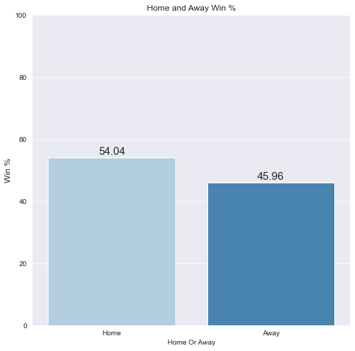
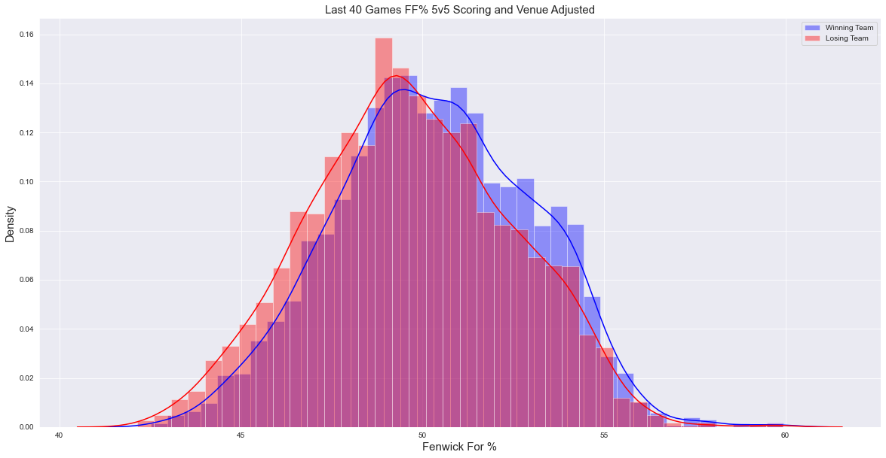
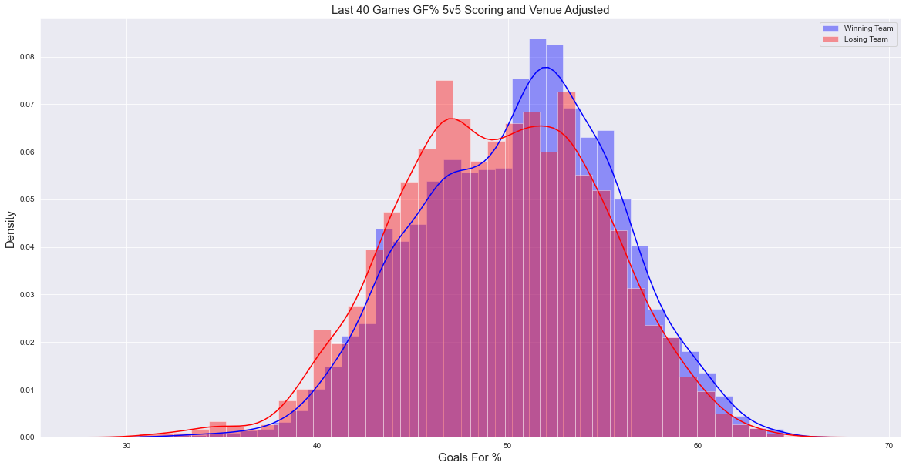
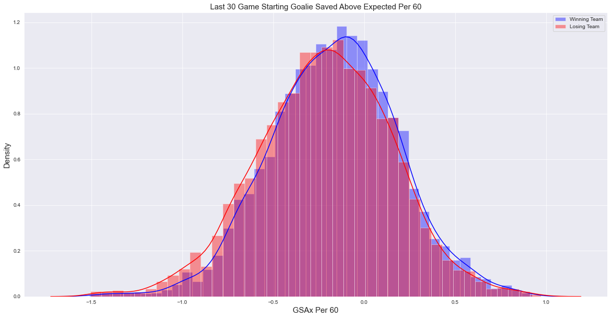

# NHL Game Prediction Modeling
by Gary Schwaeber

## Business Problem
With sport betting becoming increasingly popular and mainstream, I believe that data science can be used to make superior decisions over gut intuitions. By building a game prediction model, built with features inspired by the latest in advanced analytics and using machine learning models, games can be predicted with greater accuracy that can potentially allow users to gain an edge on bookmakers. Another potential users of this model are media analysts looking to enrich their analysis with a better understanding of which team is likely to win their game

## Data Collection
Team and goalie game logs were scraped from [Natural Stat Trick](https://www.naturalstattrick.com/). Official NHL game results were scraped from the NHL API via the python library [hockey_scraper](https://hockey-scraper.readthedocs.io/en/stable/hockey_scraper.html).

## Features
Team features include:
- Fenwick For% 
- Goals For %
- Expected Goals For %
- Shooting %
- PP TOI Per Game
- PK TOI Per Game
- xGF Per Minute PP
- xGA Per Minute PK
- Played Back to Back

Goalie Features include:
- Fenwick SV%
- Goals Saved Above Expected Per 60
- High Danger Save %

See the [glossary](https://www.naturalstattrick.com/glossary.php?teams) from Natural Stat Trick for more context on some of the statistics

## Exploratory Data Analysis
Home teams won 54% of games from the 2017-2018 season to present

Home teams are winning decreasingly less games over the seasons

Looking that the B2B effect on home win% it appears that the home team playing on a back to back has a much bigger effect than when the away team is playing in a back to back. I am unsure of the causation behind this. 

The 3 most prominent team features that show up visually in distributions of winning vs losing teams are Fenwick For%, Goals For %, and Expected Goals For % for the last 40 games. From the below three graphs you can see the winning teams distributions are slightly to the right with fatter right tails than the losing teams. Still, the distributions aren't so different, showing that any team can win the game on any given night. 

Looking at the below two goalie stats distributions, we again see the distribution of winning teams have higher quality goaltending, but only slightly

## Modeling
I trained logistic regression, ada boost, and gradient boosting models in an attempt to make the best possible game prediction model. I trained my models using game results from seasons '2017-2018', '2018-2019', '2019-2020'. I used grid search to tuned model hyperparemetres. I tried using 40 game rolling, a mix of 5 and 40 game rolling to capture short term streakiness, and all features (3,5,10,20,30,40 rolling games) with recursive feature elimination to see which mix of features worked best. Once I have some optimized models, I will then predict on held out games from the current 2021 season and evaluate the models. The score I will look to optimize is log loss, however, I will also review accuracy scores due to their interpretability.

## Results
The best model was logistic regression with the rolling 5 and 40 features on the test data. Interestingly, this was the 4th best model on the CV training data set though it did have the best CV accuracy. The gradient boosting models did very poorly and were not worth applying to the test set.

There are currently a handful of public models whose log loss on the current season's games is being [tracked](https://hockey-statistics.com/2021/05/03/game-projections-january-13th-2021/) on which I can compare the quality of my model to. Although I did not do better than the implied odds, my best model is competitive and performed roughly in the middle of the listed public models with a log loss on the 2021 season of 0.657201.

## Next Steps
To further improve the models I would like to take the following next steps

- Train a neural network model
- Categorize B2B better
- Include team ELO feature
- Try linear weightings in rolling features
- Increase goalie games
- Add prior year goalie GAR feature
- Add Team HDSC % feature
- Add more seasons to training set
- Compare against historical implied odds from a bookmaker
- Adjust ineperienced goalie imputed stats and exclude 2021 season to avoid data leakage on test set

