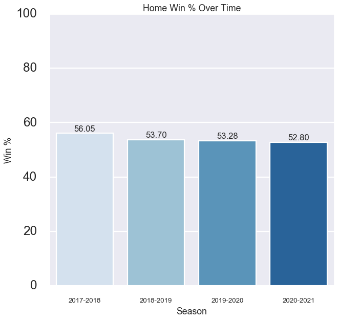
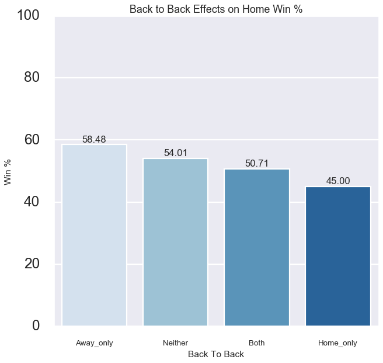
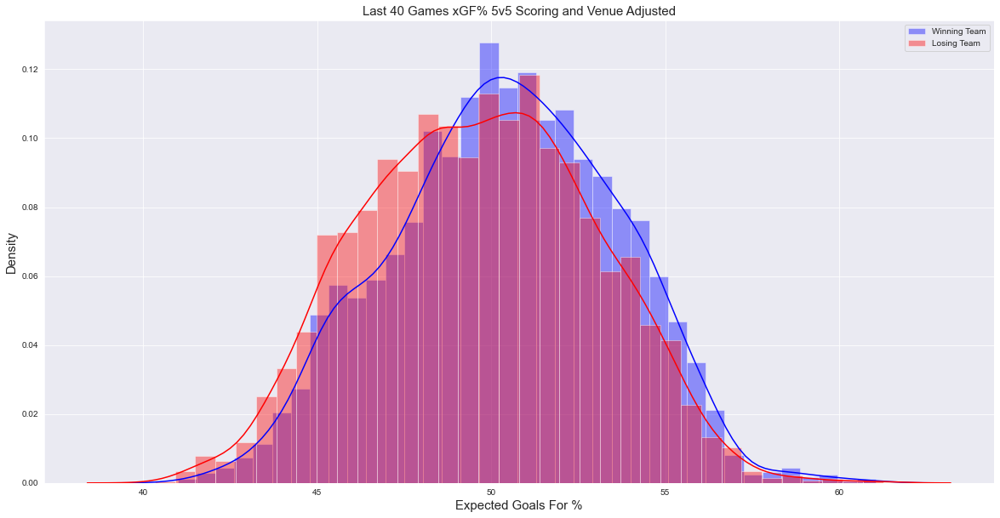
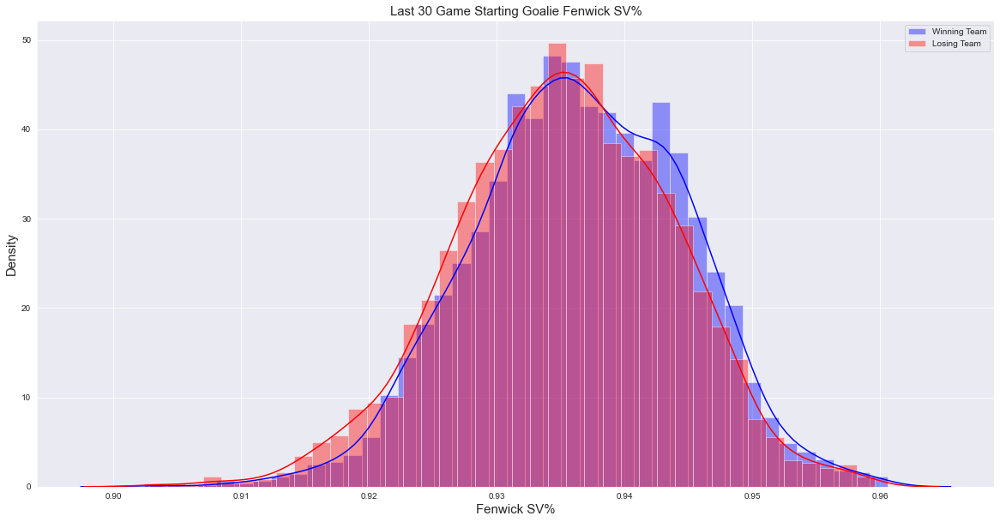
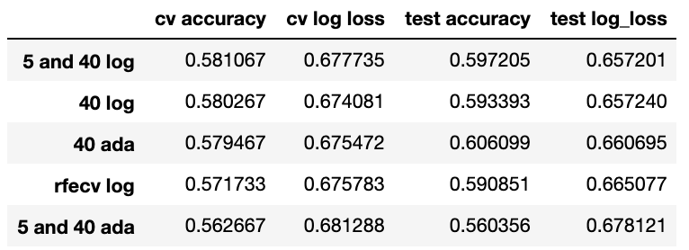

# NHL Game Prediction Modeling
by Gary Schwaeber

## Overview
With sports betting becoming increasingly popular and mainstream I believe that data science can be used to make superior decisions over gut intuitions. Unlike in Football or Basketball where betting against the spread is the most popular type of betting, the moneyline is king in the NHL due to lower scoring games. When betting the moneyline, the way to gain an edge is if you know the truer probability of the game outcome then the implied odds from the moneyline. Over the course of the season, if your internally derived game probabilities are superior to the bookakers', you can be profitable. The goal of this project is to create a model that can output better outcome probabilities that can be implemented into a profitable betting strategy.

## [Data Collection](https://github.com/gschwaeb/NHL_Game_Prediction/blob/master/Data_Collection.ipynb)
Team and goalie game logs were scraped from [Natural Stat Trick](https://www.naturalstattrick.com/). Official NHL game results were scraped from the NHL API via the python library [hockey_scraper](https://hockey-scraper.readthedocs.io/en/stable/hockey_scraper.html).

### Features
Team features include:
- 5v5 Fenwick For% Score and Venue Adjusted
- 5v5 Goals For % Score and Venue Adjusted
- 5v5 Expected Goals For % Score and Venue Adjusted
- 5v5 Shooting % Score and Venue Adjusted
- xGF Per Minute PP
- GF Per Minute PP
- xGA Per Minute PK
- GA Per Minute PK
- Team Elo Rating (courtesy of [Neil Paine](https://github.com/NeilPaine538/NHL-Player-And-Team-Ratings))
- Played Back to Back

Goalie Features include:
- Fenwick SV%
- Goals Saved Above Expected Per 60
- High Danger Save %

See the [glossary](https://www.naturalstattrick.com/glossary.php?teams) from Natural Stat Trick for more context on some of the statistics

## [Exploratory Data Analysis](https://github.com/gschwaeb/NHL_Game_Prediction/blob/master/Exploratory%20Data%20Analysis.ipynb)

Home teams win the majority of games, but are winning decreasingly less games over the seasons.

Looking that the B2B effect on home win% it appears that the home team playing on a back to back has a much bigger effect than when the away team is playing in a back to back. I am unsure of the causation behind this. 

The most prominent team features that show up visually in a distribution of winning vs losing teams is Expected Goals For % for the last 40 games. From the below  graphs you can see the winning teams distribution is slightly to the right with fatter right tails than the losing team. Still, the distributions have a lot of overlap showing that bad teams win and good teams lose often.

Looking at the below two goalie stats distribution, we again see the distribution of winning teams have higher quality goaltending, but only slightly

## [Modeling](https://github.com/gschwaeb/NHL_Game_Prediction/blob/master/Modeling%20Final.ipynb)
I trained Logistic Regression, AdaBoost, Gradient Boosting, and Neural Network models in an attempt to make the best possible game prediction model. I trained my models using game results from seasons '2017-2018', '2018-2019', '2019-2020'. I used grid search to tune model hyperparemetres. I used 3 different feature sets in the modeling process:
- A 40 game rolling window to capture longer term trends
- A mix of 5 and 40 game rolling to capture short term streakiness along with the longer term trend
- All rolling window features I engineered (3,5,10,20,30,40 rolling games) with recursive feature elimination to see which mix of features worked best and if that algorithm could find some patterns in the data with different rolling window lengths.  

The score I used to optimize and judge the models was log loss, however, I also reviewed accuracy scores due to their interpretability. Log-loss is indicative of how close the prediction probability is to the corresponding actual/true value (0 or 1 in case of binary classification). The more the predicted probability diverges from the actual value, the higher is the log-loss value, [Source](https://towardsdatascience.com/intuition-behind-log-loss-score-4e0c9979680a).

Once I trained and optimized the models, I then predicted on held out games from the current 2021 season. 

### Modeling Results
The best model was the Neural Network with team rolling 40 game features on the training and test data. The Neural Network models generally did best and the models trained on 40 game only rolling features generally did best. 

There are currently a handful of public models whose log loss on the current season's games is being [tracked](https://hockey-statistics.com/2021/05/03/game-projections-january-13th-2021/) on which I can compare the quality of my model to. Although I did not do better than the implied odds, my best model is competitive and performed roughly in the middle of the listed public models with a log loss on the 2021 season of 0.655534.

## Evaluating Model Profitability
I back tested the predictions from my best model against [historical odds](https://www.sportsbookreviewsonline.com/scoresoddsarchives/nhl/nhloddsarchives.htm). With a strategy of bet to win $100 on teams where the model's probability to to win is greater than the implied odds. The strategy resulted in an ROI of 2.04% per bet and profit of $1,473.69. The model typically liked the home team (betting the home team 59.1% vs 23.2% on the away team) and typically liked the underdog (betting 47.2% on the underdog vs 23.2% on the favorite). The model did not bet on 17.6% of games due to the vig pushing implied probabilities above the model's probability output for both the home and away team winning in those games. Below we can see the cumulative profit over time which is certainly a roller coaster.
Although this is a backtested scenario, this does provide evidence that the model can potentially provide a profitable betting strategy in the future when predicting on out of sample games. 

## Next Steps
To further improve the models and the project overall, I would like to take the following next steps

- Build a bottom up model using individual player data
- Implement a voting classifier
- Build a web app to publish future game predictions

## Contact
Gary Schwaeber
gschwaeb@gmail.com
linkedin.com/in/gary-schwaeber
github.com/gschwaeb
gsstats.medium.com

